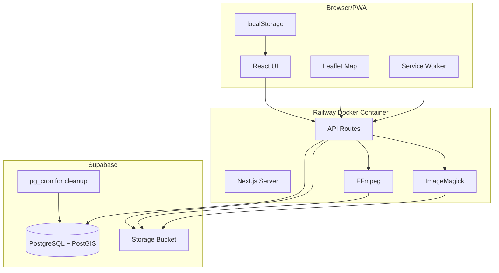
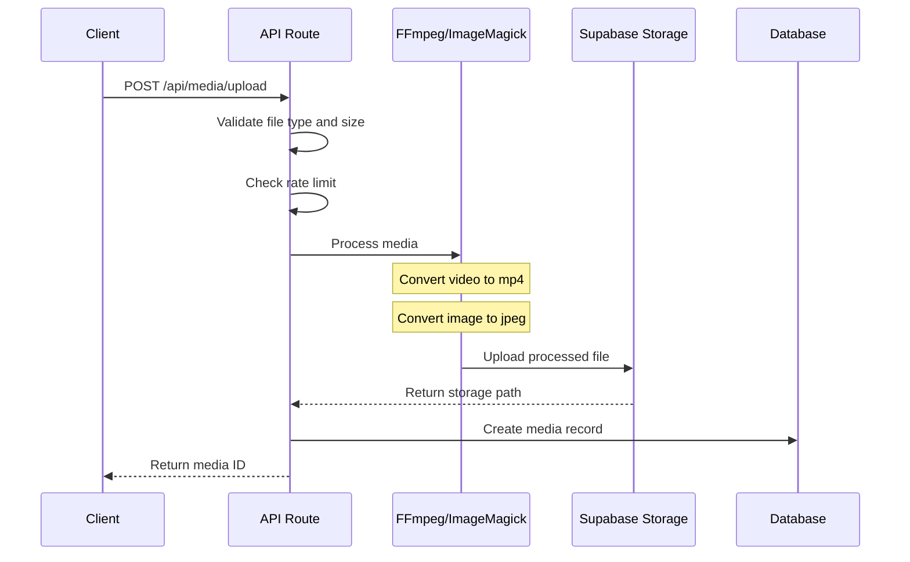
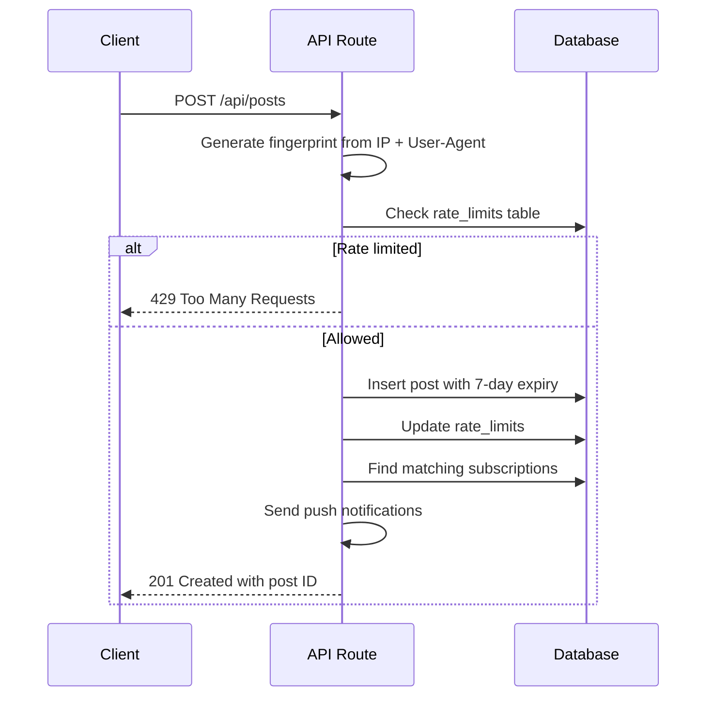

# icemap.app Architecture

## Overview

icemap.app is an anonymous, location-based incident reporting PWA that allows users to report and view incidents on a map. Posts auto-delete after 7 days to avoid false positives. No authentication required.

## Tech Stack

| Layer | Technology |
|-------|------------|
| Frontend | Next.js 16.1.1, React, TypeScript |
| Styling | Tailwind CSS |
| Maps | Leaflet + OpenStreetMap + react-leaflet |
| Backend | Next.js API Routes (server-side only) |
| Database | Supabase PostgreSQL with PostGIS |
| Storage | Supabase Storage |
| Media Processing | FFmpeg + ImageMagick (in Docker) |
| Testing | Vitest |
| Deployment | Railway with Docker |

## Monorepo Structure

```
icemap.app/
├── apps/
│   └── web/                    # Next.js PWA application
│       ├── src/
│       │   ├── app/            # Next.js App Router
│       │   │   ├── api/        # Server-side API routes
│       │   │   ├── post/[id]/  # Post detail page
│       │   │   └── page.tsx    # Map home page
│       │   ├── components/     # React components
│       │   ├── lib/            # Utilities and Supabase client
│       │   └── types/          # TypeScript types
│       ├── public/             # Static assets + PWA manifest
│       └── Dockerfile          # Docker with FFmpeg/ImageMagick
├── packages/
│   └── supabase/               # Supabase migrations and types
│       ├── migrations/         # SQL migrations
│       └── seed.sql            # Seed data for incident types
├── docs/                       # Documentation
├── pnpm-workspace.yaml         # Monorepo workspace config
├── .env.example                # Environment variables template
└── README.md
```

## Database Schema

### Posts Table
```sql
CREATE TABLE posts (
  id UUID PRIMARY KEY DEFAULT gen_random_uuid(),
  location GEOGRAPHY(POINT, 4326) NOT NULL,
  city TEXT,
  state TEXT,
  cross_street TEXT,
  summary TEXT NOT NULL,
  incident_type TEXT NOT NULL,
  fingerprint TEXT NOT NULL,  -- For rate limiting
  created_at TIMESTAMPTZ DEFAULT NOW(),
  expires_at TIMESTAMPTZ DEFAULT NOW() + INTERVAL '7 days'
);

-- Spatial index for bounding box queries
CREATE INDEX posts_location_idx ON posts USING GIST(location);
-- Index for auto-deletion
CREATE INDEX posts_expires_at_idx ON posts(expires_at);
```

### Media Table
```sql
CREATE TABLE media (
  id UUID PRIMARY KEY DEFAULT gen_random_uuid(),
  post_id UUID REFERENCES posts(id) ON DELETE CASCADE,
  storage_path TEXT NOT NULL,
  media_type TEXT NOT NULL,  -- 'image' or 'video'
  original_filename TEXT,
  created_at TIMESTAMPTZ DEFAULT NOW()
);
```

### Comments Table
```sql
CREATE TABLE comments (
  id UUID PRIMARY KEY DEFAULT gen_random_uuid(),
  post_id UUID REFERENCES posts(id) ON DELETE CASCADE,
  fingerprint TEXT NOT NULL,
  anonymous_id TEXT NOT NULL,  -- Random ID like 'user_a7b3c9'
  content TEXT NOT NULL,
  created_at TIMESTAMPTZ DEFAULT NOW()
);

CREATE INDEX comments_post_id_idx ON comments(post_id);
CREATE INDEX comments_fingerprint_idx ON comments(fingerprint);
```

### Anonymous Users Table
```sql
-- Maps fingerprints to consistent anonymous IDs
CREATE TABLE anonymous_users (
  fingerprint TEXT PRIMARY KEY,
  anonymous_id TEXT NOT NULL UNIQUE,  -- e.g., 'anon_x7k2m9'
  created_at TIMESTAMPTZ DEFAULT NOW()
);
```

### Votes Table
```sql
CREATE TABLE votes (
  id UUID PRIMARY KEY DEFAULT gen_random_uuid(),
  post_id UUID REFERENCES posts(id) ON DELETE CASCADE,
  fingerprint TEXT NOT NULL,
  vote_type INTEGER NOT NULL,  -- 1 for upvote, -1 for downvote
  created_at TIMESTAMPTZ DEFAULT NOW(),
  UNIQUE(post_id, fingerprint)  -- One vote per user per post
);

CREATE INDEX votes_post_id_idx ON votes(post_id);
```

### Favorites Table
```sql
CREATE TABLE favorites (
  id UUID PRIMARY KEY DEFAULT gen_random_uuid(),
  post_id UUID REFERENCES posts(id) ON DELETE CASCADE,
  fingerprint TEXT NOT NULL,
  created_at TIMESTAMPTZ DEFAULT NOW(),
  UNIQUE(post_id, fingerprint)  -- One favorite per user per post
);

CREATE INDEX favorites_fingerprint_idx ON favorites(fingerprint);
CREATE INDEX favorites_post_id_idx ON favorites(post_id);
```

### Reports Table
```sql
CREATE TABLE reports (
  id UUID PRIMARY KEY DEFAULT gen_random_uuid(),
  post_id UUID REFERENCES posts(id) ON DELETE SET NULL,
  fingerprint TEXT NOT NULL,
  reason TEXT NOT NULL,
  status TEXT DEFAULT 'pending',  -- pending, reviewed, dismissed
  created_at TIMESTAMPTZ DEFAULT NOW()
);

CREATE INDEX reports_status_idx ON reports(status);
```

### Subscriptions Table
```sql
CREATE TABLE subscriptions (
  id UUID PRIMARY KEY DEFAULT gen_random_uuid(),
  fingerprint TEXT NOT NULL,
  bounding_box BOX NOT NULL,  -- SW and NE corners
  push_endpoint TEXT,
  push_p256dh TEXT,
  push_auth TEXT,
  created_at TIMESTAMPTZ DEFAULT NOW()
);

CREATE INDEX subscriptions_bbox_idx ON subscriptions USING GIST(bounding_box);
```

### Rate Limits Table
```sql
CREATE TABLE rate_limits (
  fingerprint TEXT PRIMARY KEY,
  last_post_at TIMESTAMPTZ NOT NULL,
  post_count INTEGER DEFAULT 1
);
```

### Incident Types
Default incident types to seed:
- Traffic Accident
- Road Hazard
- Police Activity
- Fire/Emergency
- Weather Event
- Construction
- Public Safety
- Other

## API Routes

All API routes are server-side only. Supabase is NEVER called from the client.

| Route | Method | Description |
|-------|--------|-------------|
| `/api/posts` | GET | Fetch posts within bounding box |
| `/api/posts` | POST | Create new post with rate limiting |
| `/api/posts/[id]` | GET | Get single post with media, comments, and vote count |
| `/api/posts/[id]/comments` | GET | Get comments for a post |
| `/api/posts/[id]/comments` | POST | Add comment to a post |
| `/api/posts/[id]/vote` | POST | Upvote or downvote a post |
| `/api/posts/[id]/favorite` | POST | Add post to favorites |
| `/api/posts/[id]/favorite` | DELETE | Remove post from favorites |
| `/api/posts/[id]/report` | POST | Report a post - sends email to admin |
| `/api/favorites` | GET | Get user favorites list |
| `/api/media/upload` | POST | Upload and process media |
| `/api/subscriptions` | POST | Subscribe to area notifications |
| `/api/subscriptions` | DELETE | Unsubscribe from notifications |
| `/api/me` | GET | Get current user anonymous ID from fingerprint |

## System Architecture Diagram



## Media Upload Flow



## Post Creation Flow



## Auto-Deletion Strategy

Using Supabase pg_cron extension:

```sql
-- Run every 15 minutes to delete expired posts
SELECT cron.schedule(
  'delete-expired-posts',
  '*/15 * * * *',
  $$DELETE FROM posts WHERE expires_at < NOW()$$
);
```

Media files are automatically deleted via CASCADE when posts are deleted. A separate cleanup job removes orphaned storage files.

## Rate Limiting Strategy

Fingerprint generation combines:
- Client IP address (from X-Forwarded-For or request IP)
- User-Agent header
- Accept-Language header

Hashed together with SHA-256 to create anonymous but consistent fingerprint.

**Rule**: 1 post per hour per fingerprint.

## PWA Features

- **Manifest**: App name, icons, theme colors, display mode
- **Service Worker**: Cache static assets, offline fallback page
- **Push Notifications**: Web Push API for area alerts
- **Geolocation**: HTML5 Geolocation API for Find My Location

## Environment Variables

```env
# Supabase (server-side only - NEVER expose to client)
SUPABASE_URL=https://your-project.supabase.co
SUPABASE_SERVICE_ROLE_KEY=your-service-role-key

# Push Notifications (VAPID keys)
NEXT_PUBLIC_VAPID_PUBLIC_KEY=your-vapid-public-key
VAPID_PRIVATE_KEY=your-vapid-private-key

# App Config
NEXT_PUBLIC_APP_URL=https://icemap.app
NODE_ENV=production

# Optional: Mapbox (if using Mapbox instead of OSM)
NEXT_PUBLIC_MAPBOX_TOKEN=your-mapbox-token
```

## Dockerfile Configuration

```dockerfile
FROM node:20-alpine AS base

# Install FFmpeg and ImageMagick for media processing
RUN apk add --no-cache ffmpeg imagemagick

# ... rest of multi-stage build
```

## Security Considerations

1. **No Authentication**: All posts are anonymous, no user accounts
2. **Server-Side Only**: Supabase calls NEVER happen on client
3. **Rate Limiting**: 1 post per hour per fingerprint prevents spam
4. **Auto-Deletion**: 7-day TTL prevents stale/false information
5. **Input Validation**: All inputs sanitized server-side
6. **CORS**: Strict CORS policy on API routes
7. **File Validation**: Media files validated for type and size before processing

## Key Dependencies

| Package | Purpose |
|---------|---------|
| `next` | React framework with App Router |
| `react-leaflet` | React wrapper for Leaflet maps |
| `leaflet` | Map rendering library |
| `leaflet.markercluster` | Marker clustering plugin |
| `@supabase/supabase-js` | Supabase client (server-side only) |
| `fluent-ffmpeg` | FFmpeg wrapper for Node.js |
| `sharp` | Fast image processing (alternative to ImageMagick) |
| `web-push` | Web Push notifications |
| `vitest` | Testing framework |

